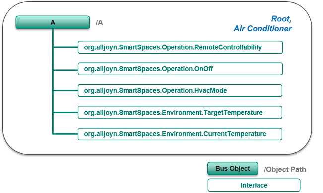
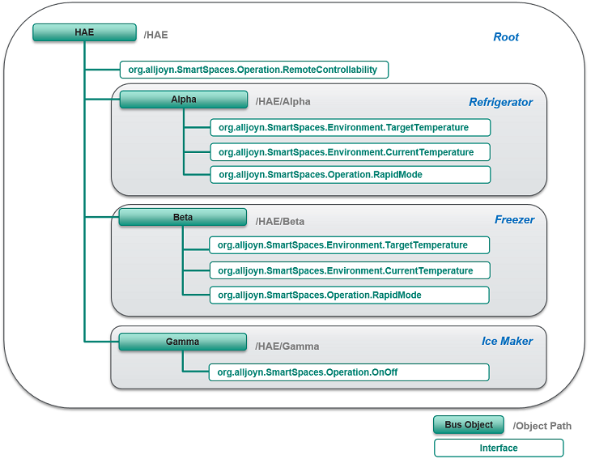
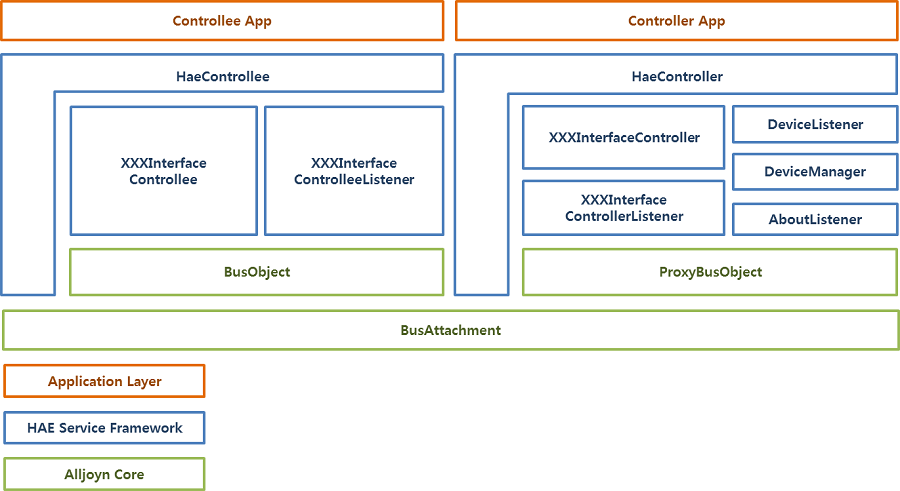
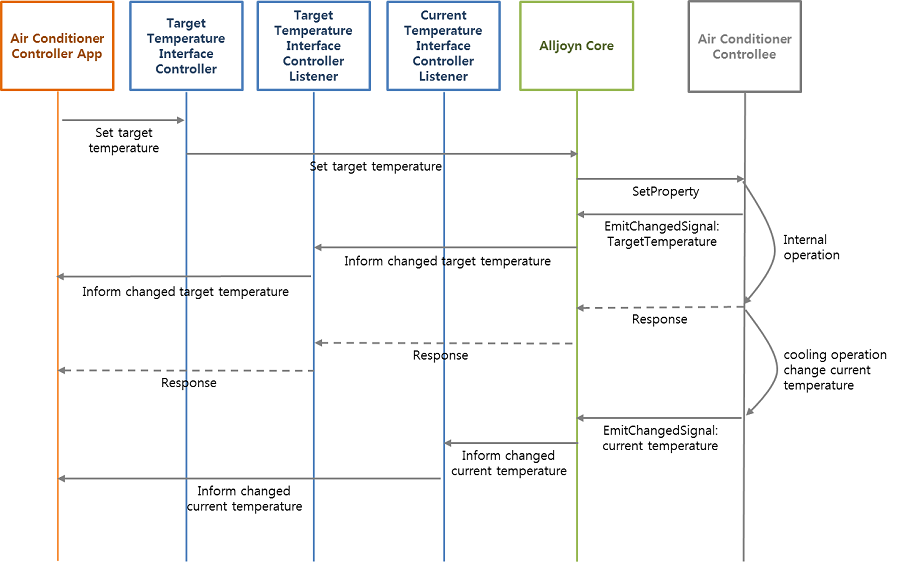
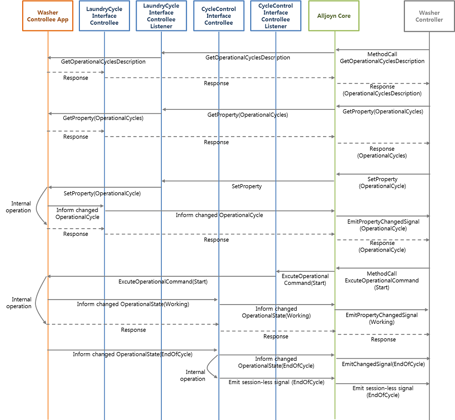

Home Appliances & Entertainment (HAE) Service Framework High-Level Design Document
====
September 21, 2015
----

## Introduction

### Purpose and scope

This document describes the system level design for the Home Appliances &
Entertainment Service Framework to support a common way of controlling and
monitoring HAE category devices, regardless of device manufacturers.
Related interfaces and API design is captured at a functional level.
Actual definition for interfaces is outside the scope of this document.

### Revision history

| Revision            | Date                 | Change Log                        |
|---------------------|----------------------|-----------------------------------|
| Rev 1 update 0      | September 21, 2015   | Draft 0.1                         |

### Acronyms and terms

| Acronym/term        | Description                                              |
|---------------------|----------------------------------------------------------|
| About data          | Data from the About feature.  For more information, refer to the  About Feature Interface Spec.|

## System Design

### Overview

The _Figure 1_ describes the overall architecture of the HAE service framework.
The _Controllee App_ in the figure works on the HAE devices such as a refrigerator,
an air conditioner or a clothes washer. The _Controller App_ is an application
software that runs on the user's terminal such as a smart phone or a tablet, and
communicates with HAE controllee devices through the AllJoyn bus. The HAE service
framework implements all the required interfaces to represent HAE devices over the
AllJoyn bus and control the HAE devices. Application developers making use this
service framework implement against the HAE service framework APIs (controllee and
controller side).

Figure 1: HAE service framework architecture within the AllJoyn framework

### Device Model

Following the AllJoyn bus object structure, a real HAE device will expose
its interaction capabilities via implemented AllJoyn interfaces. Depending
on its actual complexity, the real device will have one or more HAE devices
in its AllJoyn representation. By using the additional metadata field,
org.AllJoyn.SmartSpaces.DeviceDescription, in About announcement,
the AllJoyn bus objects corresponding to all HAE devices used for AllJoyn
representation of real device shall be identified. Every bus object doesn't
necessarily have to be identified with its associated device type. Children
objects whose device types are not identified will inherit their parent's
device type. The names for bus object paths can be arbitrarily chosen.

#### Simple Device Model

A simple device model has only one HAE device right under the HAE root bus object.
As described in _Figure 2_, the real air conditioning device is represented
by using a single bus object whose device type is identified as _Air Conditioner_
type by the About metadata field, _org.AllJoyn.SmartSpaces.DeviceDescription_.
The _Root_ device will be also given to the same bus object to indicate that
it is a HAE root bus object.

Under this bus object, the air conditioner exposes its capabilities
such as getting remote control disabled/enabled status, on/off control,
setting target temperature, and getting current temperature by the
implemented interfaces.

Root device of simple model can have its children HAE devices at need.

Figure 2: Example simple device model for air conditioner

#### Combo Device Model

A combo device model houses two or more HAE devices right under the HAE
root bus object. There are already so many types of complicated home
appliances housing multiple sub units where each sub unit can be easily
seen as a separate real product on the market. For examples, some kitchen
appliances consist of oven and cooktop, some refrigerators have multiple
refrigeration compartments and even ice maker. More creative innovations
will come in the HAE category products.

_Figure 3_ illustrates an example combo device model for refrigerator.
This refrigerator consists of two refrigeration compartments and one
ice maker. So the entire device contains three children HAE devices:
_Refrigerator_, _Freezer_, and _Ice Maker_. Each bus object corresponding
to sub units or children devices reveals their exposed interaction
capabilities.

The root bus object doesn't have any device type associated other than
the _Root_ device type. The _Root_ device type is just introduced to
identify where is the bus object that represents the entire real device.
If there are any interfaces that should be implemented for the entire
device, they should be just under the root bus object, not under its
children devices. As seen in _Figure 3_, the remote controllability
interface, org.alljoyn.SmartSpaces.Operation.RemoteControllability,
right under the HAE root bus object applies to the entire device.

Figure 3: Example combo device model for refrigerator

#### Semantic Meaning Identification of Interfaces

The AllJoyn interfaces developed for modelling HAE devices are defined as
generic as possible to increase re-usability across devices and even by other
service frameworks. So sometimes, the semantic meanings of the implemented
interfaces can't be resolved without knowing its associated device type.
As can be seen in _Figure 3_, the same temperature related interfaces are
implemented under "/A/Alpha" and "/A/Beta", respectively. One is for
the refrigerator compartment, and the other is for the freezer compartment.
Their semantic meanings distinction can be done by figuring out what are
their associated device types. The same temperature related interfaces
can be also implemented for _Air Conditioner_, _Oven_, and _Food Probe_, etc.

### HAE device block architecture

The _Figure 4_ describes block diagram for HAE controllee device and HAE
controller device. The Controllee App and Controller App can be developed
using the HAE Service Framework by different manufacturers.
The HaeControllee or HaeController is in charge of start/stop the HAE Service
of the HAE device. The HaeControllee manages a list of InterfaceControllees and
InterfaceControlleeListeners. XXX means interface name such as
TargetTemperature and CurrentTemperature. All interfaces in the HAE specification
correspond each XXXInterfaceControllee and XXXInterfaceControlleeListener.
For example, if there is a refrigerator that includes the TargetTemperature
interface. The refrigerator controllee device should implement the
TargetTemperatureInterfaceControllee and TargetTemepratureInterfaceControlleeListener.

The HaeControllee application set the local value via the InterfaceControllee
and receive the remote request via the InterfaceControlleeListener.
At this time, application use the instances of InterfaceControllee and
InterfaceControlleeListener directly. The InterfaceControllee should be
implemented following the HAE interface specification.
The InterfaceControlleeListener that is a handler for receiving the method call
of specific interface from the controller. These InterfaceControllees and
InterfaceControlleeListeners operate with a bus object.

HAE controller should manage interest device list. The HaeController can
communicate with the controllee device through the InterfaceController and
InterfaceControllerListener. The Device Manager manages device list and
connection status of each interest device. Once About listener receives
the About announcement from HAE devices, the DeviceManager add device info
and notify the device info connected to the application by the
DeviceListener. The DeviceManager provides a function to find interest devices
using the DeviceDescription that is one of the About custom metadata fields
to represent device type corresponding to the bus object. The DeviceListener
conveys each device’s connection status and About data to the application.
HAE controller application can send the request to the controllee via the
InterfaceController and receive the response and signal through the
InterfaceControllerListener.
The XXXInterfaceController and XXXInterfaceControllerListener has the same
approach with the XXXInterfaceControllee and XXXInterfaceControlleeListener,
if controller wants to control the TargetTemperature interface, controller
should have the TargetTemperatureControllerInterface to call the method and
also should have the TargetTemperatureControllerInterfaceListener to receive
the response of method call and signal.

Figure 4: Architecture for the HAE controllee and controller devices

### Typical Operations

#### Discovery

Discovery of HAE service framework follows the general mechanism of the About feature.
But since there is no representative interface for HAE service framework
and different HAE device types will implement different sets of interfaces,
the presence of the DeviceDescription metadata field in About announcement
shall be used for discovery of the HAE service framework instead.
Details of DeviceDescription metadata and other custom metadata fields
refer to the theory-of-operation document of the specification.

_Figure 5_ illustrates a typical discovery call flow for HAE service framework.
At first, the Controllee App register the About custom metadata fields, device types
and interfaces to the HaeControllee in order to announce the device types and capabilities.
At next, the HaeControllee makes the DeviceDescription including tuples
consists of HAE device identifier and bus object path. The DeviceDescrpition
is announced by the About feature.
In the controller side, the Controller App register interest device types to
the HaeController and if the HaeController receives the About announcement,
it checks the presence of the DeviceDescription metadata and also examines
whether the DeviceDescription includes interest device types or not.
If the Controller App finds interest device, it process a joining session.
After joining session, the HaeController gets proxy bus object and creates
the InterfaceController which corresponds to the InterfaceControllee of
the target interface. Once controller creates the InterfaceController,
controller can call method via InterfaceController.

Figure 5: Discovery call flow

#### Method Call

HAE Service Framework provides asynchronous method call only because many
appliances might have low performance hardware and it could generate a response
delay of the method call. In this case, to avoid pending controller, only
asynchronous method call is supported.

_Figure 6_ illustrates the sequence of the method call.
The Controller App needs the InterfaceController to call the method of target
interface and the Controllee App can receive the method call via
InterfaceControlleeListener. The response of method call can be conveyed by the
InterfaceControllerListener. 
For example, the air conditioner controller wants to change the target
temperature, the Controller App can set the target temperature using the
TargetTemperatureInterfaceController, this method call can conveyed to the
controllee by the TargetTemperatureInterfaceControlleeListener and the air
conditioner controller can receive the response of method call through the
TargetTemperatureControllerListener.

Figure 6: Async method call sequence

#### Signal Handling

Signal handling process uses the InterfaceControllee and
InterfaceControllerListener. When air conditioner change current temperature
by internal logic, the Controllee App change internal value of
the CurrentTemeperatureInterfaceControllee, This value is sent to the controller
and the controller can receive this signal through the
CurrentTemperatureinterfaceControllerListener. _Figurue 7_ illustrates this
signal handling sequence.

Figure 7: Signal handling sequence

### Sample use cases

#### Setting target temperature sequence in the air conditioner controller

Figure 8: Setting target temperature sequence in the air conditioner controller

#### Setting target temperature sequence of air conditioner

Figure 9: Setting target temperature sequence of air conditioner

#### Setting operational cycle sequence in the washer controller

Figure 10: Setting operational cycle sequence in the washer controller

#### Setting operational cycle sequence in the washer

Figure 11: Setting operational cycle sequence in the washer

