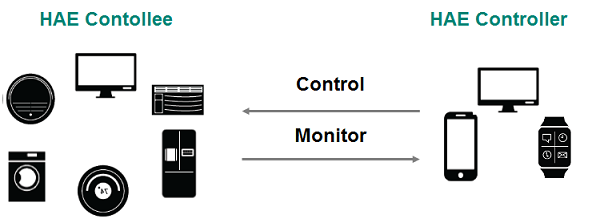
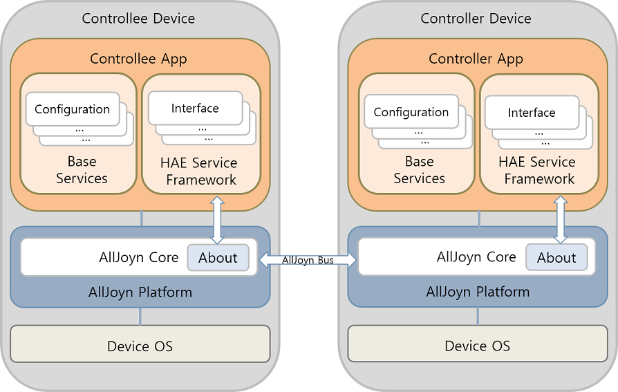
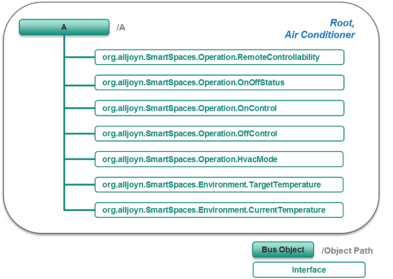
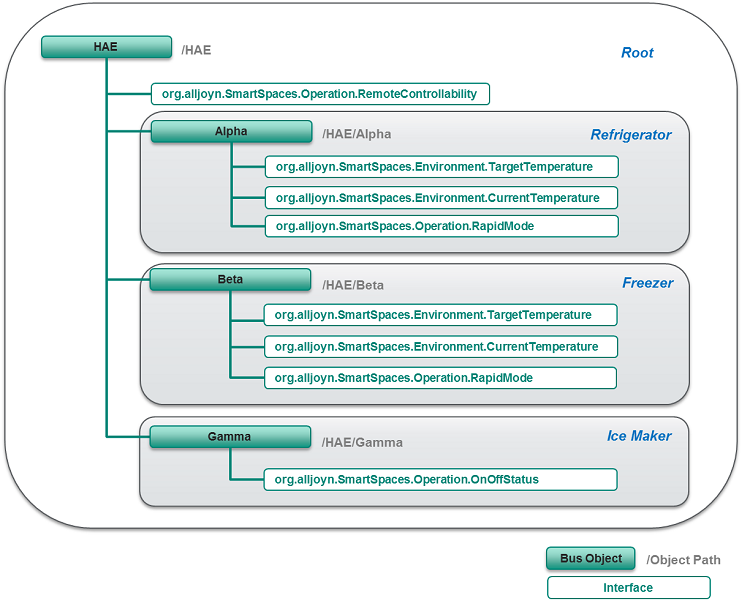
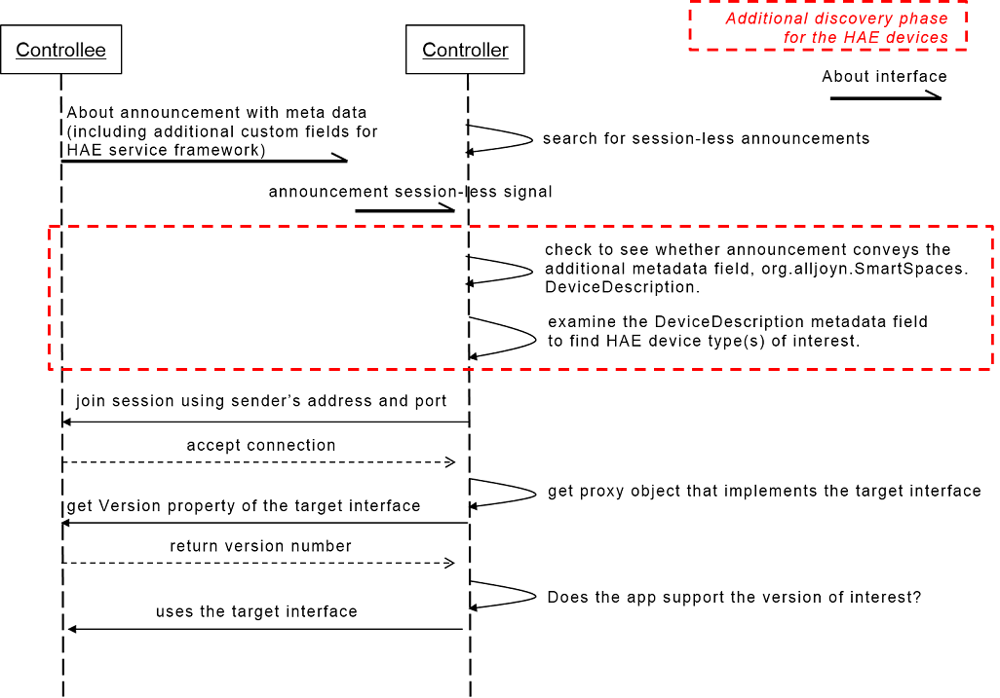

## Theory of Operation version 1

This document describes the theory of operation how the Home Appliances and
Entertainment (HAE) Service Framework should work.

### Overview

HAE service framework defines a common set of standard interfaces to be shared
for AllJoyn representation of HAE devices and provides a common open source
implementation. These standard interfaces abstract common capabilities across
device vendors and across device types. The followings are benefits of
this service framework.

##### Cross-vendor interoperability

The common set of standardized AllJoyn interfaces establish the cross-vendor
interoperability. Devices from different vendors can interact with each other,
and devices from various vendors will be controlled and monitored by a control
application from another vendor. In addition to the guaranteed interoperability,
consistent user experiences across devices from different vendors can be
provided to end-users thanks to the shared common set of capabilities.

##### Machine-to-machine interactions

AllJoyn provides the control panel service framework to control devices, but it
requires human's interpretation and interaction at the controller side to
control devices. To support various IoT automation services, background control
and monitoring should be enabled. With this framework, users don't need to see
and touch their mobile or smart watch to control and monitor their devices.
Voice or text based interactions will be enabled. Machine-to-machine interaction
is one of key benefits of this service framework.

##### Tailor-made UI for each controller screen

Using the control panel might be unsuitable for smart watch or non-screen
devices. With a single control panel UI data, it is not easy to satisfy all the
various screen sizes and shapes of the controlling devices such as smart watch,
phone, tablet and TV. The HAE service framework is targeted to provide
predefined device capabilities so that the controller application developers
can deliver tailor-made UI targeted for each controller screen to end-users.

#### Use Cases

The HAE service framework has two types of use cases such as monitoring and
controlling. A HAE controller monitors the current operational status of the HAE
controllee and the controller is warned about interested situation of the HAE
controllee. The HAE controller interacts with one or more HAE controllees to
control their operations. Figure 1 illustrates the usecases between the HAE
controllee and the HAE controller.

Figure 1: Usecases of controlling and monitoring

#### Overall Architecture

The _Figure 2_ describes the overall architecture of the HAE service framework.
The _Controllee App_ in the figure works on the HAE devices such as a refrigerator,
an air conditioner or a clothes washer. The _Controller App_ is an application
software that runs on the user's terminal such as a smart phone or a tablet, and
communicates with HAE controllee devices through the AllJoyn bus. The HAE service
framework implements all the required interfaces to represent HAE devices over the
AllJoyn bus and control the HAE devices. Application developers making use of this
service framework implement against the HAE service framework APIs (controllee and
controller side).

Figure 2: HAE service framework architecture within the AllJoyn framework

### Interface Namespaces

The interface namespace structure for HAE service framework is like below.

| Namespace                          | Description                            |
|------------------------------------|----------------------------------------|
| org.alljoyn.SmartSpaces.Environment| For interfaces which abstract the characteristics or control targets of environments HAE devices care about. |
| org.alljoyn.SmartSpaces.Operation  | For interfaces which abstract the operation capabilities of HAE devices.|

### Device Types

The HAE Service Framework defines 21 device types below. For the interface names,
_org.alljoyn.SmartSpaces_ prefix is omitted for simplicity.

| Device Type        | Id |  Description | Minimum required interfaces |
|--------------------|----|--------------|----------------------|
|Root                | 0  | It is introduced to locate the HAE root bus object which represent the entire device HAE service framework announces. It doesn't carry any information about device type specifics. | None |
|Other               | 1  | It is a type for a device that implements the service framework defined interface(s), but doesn't necessarily have to be recognized as a specific type of device. As an example, for a simple contact sensor which reports open/closed status of a larger objects such as a door or a window on which it is attached, the information about its implemented interface could be enough. | None |
|Refrigerator        | 2  | Device that stores food at temperatures which are a few degrees above the freezing point of water.| Operation.ClosedStatus |
|Freezer             | 3  | Device that stores food at temperatures which are a few degrees below the freezing point of water (typically about -18 &deg;C), so the food itself is safe indefinitely.| Operation.ClosedStatus |
|Ice Maker           | 4  | Device that makes ice. It exists as a sub-unit inside a refrigerator container or as a standalone-device.| None |
|Air Conditioner     | 5  | Device that alters the properties of air (primarily temperature and humidity) to more comfortable conditions. | Operation.OnOffStatus, Operation.OnControl, Operation.OffControl, Operation.HvacMode, Environment.TargetTemperature, Environment.CurrentTemperature |
|Thermostat          | 6  | Control unit that senses the temperature of a system so that the system's temperature is maintained near a desired set point. The thermostat does this by switching heating or cooling devices on or off or regulating the flow of a heat transfer fluid as needed to maintain the correct temperature.| Operation.OnOffStatus, Operation.OnControl, Operation.OffControl, Operation.HvacMode, Environment.TargetTemperature, Environment.CurrentTemperature |
|Humidifier          | 7  | Device that increases air humidity (moisture) in a single room or an entire building.| Operation.OnOffStatus, Operation.OnControl, Operation.OffControl |
|Dehumidifier        | 8  | Device that decreases air humidity (moisture) in a single room or an entire building.| Operation.OnOffStatus, Operation.OnControl, Operation.OffControl, Environment.TargetHumidity, Environment.CurrentHumidity |
|Air Purifier        | 9  | Device that has a filter that removes dust from the air.| Operation.OnOffStatus, Operation.OnControl, Operation.OffControl |
|Electric Fan        | 10 | Traditional style fan usually with blades visible from outside.| Operation.OnOffStatus, Operation.OnControl, Operation.OffControl |
|Air Quality Monitor | 11 | Device that checks and reports the air quality.| At least one between Environment.CurrentAirQuality and Environment.CurrentAirQualityLevel |
|Clothes Washer      | 12 | Device that washes laundry such as clothing and sheets.| Operation.OnOffStatus, Operation.OnControl, Operation.OffControl, Operation.CycleControl, Operation.LaundryCycle |
|Clothes Dryer       | 13 | Device that removes moisture from a load of clothing and other textiles usually shortly after they are washed in a washer.| Operation.OnOffStatus, Operation.OnControl, Operation.OffControl, Operation.CycleControl, Operation.LaundryCycle |
|Clothes Washer-Dryer| 14 | Device that executes the operations of both a washer and a dryer in a single cavity.| Operation.OnOffStatus, Operation.OnControl, Operation.OffControl, Operation.CycleControl, Operation.LaundryCycle |
|Dish Washer         | 15 | Device that cleans dishes and eating utensils.| Operation.OnOffStatus, Operation.OnControl, Operation.OffControl, Operation.CycleControl, Operation.DishWashingCycle |
|Robot Cleaner       | 16 | An autonomous robotic vacuum cleaner that has intelligent programming and a limited vacuum cleaning system. | Operation.OnOffStatus, Operation.OnControl, Operation.OffControl, Operation.CycleControl, Operation.RobotCleaningCycle |
|Oven                | 17 | Device that roasts and heats food in a complete stove. | Operation.OnOffStatus, Operation.CycleControl, Operation.OvenCycle |
|Cooker Hood         | 18 | Device that usually hangs above the stove or cooktop and it is used to removes airborne grease, combustion products, fumes, smoke, odours, heat, and steam from the air by evacuation of the air and filtration. | Operation.OnOffStatus, Operation.OnControl, Operation.OffControl, Operation.HvacMode, Operation.FanSpeedLevel |
|Cooktop             | 19 | Device with a flat framework used to place pots to be heated so the food inside is cooked. | Operation.HeatingZone |
|FoodProbe           | 20 | Device used for checking the preparation of foods (typically the meat) to ensure that the appropriate and safe internal temperature has been achieved. Some probes are inserted into the food, other are just placed close to it. | Environment.TargetTemperature, Operation.PlugInUnits |
|Television          | 21 | Device that receives broadcast programs and show the video and audio contents with its integrated display and speaker. | Operation.OnOffStatus, Operation.OnControl, Operation.OffControl, Operation.Channel, Operation.AudioVolume |
|SetTopBox           | 22 | Device that receives audio and visual contents such as broadcasting program and network streaming and convert them for showing on a display device such as TV. | Operation.OnOffStatus, Operation.OnControl, Operation.OffControl |

### Service Framework's Custom Metadata Fields

To enable HAE device discovery and provide additional information at
About announcements, the following custom metadata fields will be appended
to About and Config metadata, respectively.

#### Additional About Metadata Fields

| Field name          | Mandatory | Announced | Localized | Signature | Description  |
|---------------------|-----------|-----------|-----------|-----------|--------------|
| org.alljoyn.SmartSpaces.CountryOfProduction | no        | no        | yes       | s         | Country of production |
| org.alljoyn.SmartSpaces.CorporateBrand      | no        | no        | yes       | s         | Corporate level brand name. For example, AEG for Electrolux and Sanyo for Panasonic, etc. |
| org.alljoyn.SmartSpaces.ProductBrand        | no        | no        | yes       | s         | Product level brand name. Walkman and Bravia for Sony, Viera for Panasonic. |
| org.alljoyn.SmartSpaces.Location            | yes        | yes       | yes       | s         | Location information of a device. There is no constraint about location information. For example, classification of rooms ("Dining room", "Bedroom", "Restroom", etc.) or coordinate of GPS data can be a value of location information. |
| org.alljoyn.SmartSpaces.DeviceDescription| yes       | yes       | no        | a(ou)    | Information that identifies the HAE device types of implemented bus objects |

The fields with a yes value in the Announced column will also be published
via the Announce signal.

#### Additional Configuration Map Fields for Configuration Service

| Field name          | Mandatory | Localized | Signature | Description  |
|---------------------|-----------|-----------|-----------|--------------|
| org.alljoyn.SmartSpaces.Location| yes        | yes       | s         | Location information of a device. There is no constraint about location information. For example, classification of rooms ("Dining room", "Bedroom", "Restroom", etc.) or coordinate of GPS data can be a value of location information. |

### AllJoyn Representation Model for HAE Devices

Following the AllJoyn bus object structure, a real HAE device will expose
its interaction capabilities via implemented AllJoyn interfaces. Depending
on its actual complexity, the real device will have one or more HAE devices
in its AllJoyn representation. By using the additional metadata field,
org.AllJoyn.SmartSpaces.DeviceDescription, in About announcement,
the AllJoyn bus objects corresponding to all HAE devices used for AllJoyn
representation of real device shall be identified. Every bus object doesn't
necessarily have to be identified with its associated device type. Children
objects whose device types are not identified will inherit their parent's
device type. The names for bus object paths can be arbitrarily chosen.

#### Simple Device Model

A simple device model has only one HAE device right under the HAE root bus object.
As described in _Figure 3_, the real air conditioning device is represented
by using a single bus object whose device type is identified as _Air Conditioner_
type by the About metadata field, _org.AllJoyn.SmartSpaces.DeviceDescription_.
The _Root_ device will be also given to the same bus object to indicate that
it is a HAE root bus object.

Under this bus object, the air conditioner exposes its capabilities
such as getting remote control disabled/enabled status, on/off control,
setting target temperature, and getting current temperature by the
implemented interfaces.

Root device of simple model can have its children HAE devices at need.

Figure 3: Example simple device model for air conditioner

#### Combo Device Model

A combo device model houses two or more HAE devices right under the HAE
root bus object. There are already so many types of complicated home
appliances housing multiple sub units where each sub unit can be easily
seen as a separate real product on the market. For examples, some kitchen
appliances consist of oven and cooktop, some refrigerators have multiple
refrigeration compartments and even ice maker. More creative innovations
will come in the HAE category products.

_Figure 4_ illustrates an example combo device model for refrigerator.
This refrigerator consists of two refrigeration compartments and one
ice maker. So the entire device contains three children HAE devices:
_Refrigerator_, _Freezer_, and _Ice Maker_. Each bus object corresponding
to sub units or children devices reveals their exposed interaction
capabilities.

The root bus object doesn't have any device type associated other than
the _Root_ device type. The _Root_ device type is just introduced to
identify where is the bus object that represents the entire real device.
If there are any interfaces that should be implemented for the entire
device, they should be just under the root bus object, not under its
children devices. As seen in _Figure 4_, the remote controllability
interface, org.alljoyn.SmartSpaces.Operation.RemoteControllability,
right under the HAE root bus object applies to the entire device.

Figure 4: Example combo device model for refrigerator

#### Semantic Meaning Identification of Interfaces

The AllJoyn interfaces developed for modeling HAE devices are defined as
generic as possible to increase reusability across devices and even by other
service frameworks. So sometimes, the semantic meanings of the implemented
interfaces can't be resolved without knowing its associated device type.
As can be seen in _Figure 4_, the same temperature related interfaces are
implemented under "/HAE/Alpha" and "/HAE/Beta", respectively. One is for
the refrigerator compartment, and the other is for the freezer compartment.
Their semantic meanings distinction can be done by figuring out what are
their associated device types. The same temperature related interfaces
can be also implemented for _Air Conditioner_, _Oven_, and _Food Probe_, etc.

### Discovery

Before joining a session, discovery of HAE service framework and the implemented
HAE device types should be enabled. For this reason, the service framework's
own custom field, org.alljoyn.SmartSpaces.DeviceDescription will be appended
to About metadata.

#### DeviceDescription Field

The DeviceDescription (org.alljoyn.SmartSpaces prefix is omitted for simplicity)
metadata field conveys the information that identifies HAE device type(s)
of implemented AllJoyn bus objects. As already mentioned, every bus object
doesn't necessarily have to be identified with its associated device type.
Instead, children bus objects whose device types are not identified will inherit
their parent's device type.

The DeviceDescription is an array of tuples, each tuple consists of HAE device
type identifier(uint32) and bus object patch(string). For the air conditioner
and refrigerator examples described in _Figure 3_ and _Figure 4_,
the following values will be signaled as DeviceDescription respectively.

  * DeviceDescription = { <"/A", 0>, <"/A", 5> } for the example air conditioner
  * DeviceDescription = { <"/HAE", 0>, <"/HAE/Alpha", 2>, <"/HAE/Beta", 3>, <"/HAE/Gamma", 4> }
                      for the example refrigerator

#### Discovery Call Flow

Discovery of HAE service framework follows the general mechanism of About.
But since there is no representative interface for HAE service framework
and different HAE types will implement different sets of interfaces,
the presence of the DeviceDescription metadata field in About announcement
shall be used for discovery of the HAE service framework instead.

_Figure 5_ illustrates a typical discovery call flow for HAE service framework.
As already explained, checking to see if About announcement supports the HAE
service framework will be the first step in discovery process. After that,
the controller will examine the DeviceDescription metadata field to see
if the controllee supports HAE device(s) of interest. As a further step,
the controller can check if the discovered HAE device(s) supports interfaces
of interest.

Figure 5: Discovery call flow

## References

  * The About interface definition - https://allseenalliance.org/developers/learn/core/about-announcement/interface
  * The Config interface definition - https://allseenalliance.org/developers/learn/base-services/configuration/interface

